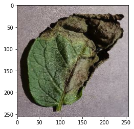

# Klasifikasi Penyakit pada Daun Kentang

Dataset diambil dari [Kaggle](https://www.kaggle.com/arjuntejaswi/plant-village) yang terdiri dari

* 1000 gambar daun kentang penyakit busuk daun
* 1000 gambar daun kentang penyakit hawar dini
* 152 gambar daun kentang sehat

### Impor libraries

```python
import tensorflow as tf
from tensorflow.keras import models, layers
import matplotlib.pyplot as plt
```

### Menentukan konstanta

```python
image_size = 256
batch_size = 32
Channels = 3
Epochs = 20
```

### Memasukan data ke dataset objek tensorflow

```python
dataset = tf.keras.preprocessing.image_dataset_from_directory(
    "PlantVillage",
    shuffle = True,
    image_size = (image_size, image_size),
    batch_size = batch_size
)
```

```
Found 2152 files belonging to 3 classes.
```

```python
class_names = dataset.class_names
class_names
```

```
['Potato___Early_blight', 'Potato___Late_blight', 'Potato___healthy']
```

```python
len(dataset)
```

```
68
```

### Menampilkan beberapa gambar dari dataset

```python
plt.figure(figsize=(10, 10))
for image_batch, label_batch in dataset.take(1):
    for i in range (12):
        ax = plt.subplot(3, 4, i+1)
        plt.imshow(image_batch[i].numpy().astype("uint8"))
        plt.title(class_names[label_batch[i]])
        plt.axis("off")
```

<figure><figcaption></figcaption></figure>

### Membagi dataset

```python
len(dataset)
```

```
68
```

```python
train_size = 0.8
len(dataset)*train_size
```

```
54.400000000000006
```

```python
data_train = dataset.take(54)
len(data_train)
```

```
54
```

```python
data_test = dataset.skip(54)
len(data_test)
```

```
14
```

```python
val_size = 0.1
len(dataset)*val_size
```

```
6.800000000000001
```

```python
data_val = data_test.take(6)
len(data_val)
```

```
6
```

```python
data_test = data_test.skip(6)
len(data_test)
```

```
8
```

```python
def get_dataset_partition_tf(ds, train_split=0.8, val_split=0.1, test_split=0.1, shuffle=True, shuffle_size=10000):
    
    data_size = len(ds)
    
    if shuffle:
        ds = ds.shuffle(shuffle_size, seed=12)
    
    train_size = int(train_split * data_size)
    val_size = int(val_split * data_size)
    
    data_train = ds.take(train_size)
    data_val = ds.skip(train_size).take(val_size)
    data_test = ds.skip(train_size).skip(val_size)
    
    return data_train, data_val, data_test
```

```python
data_train, data_val, data_test = get_dataset_partition_tf(dataset)
```

```python
len(data_train)
```

```
54
```

```python
len(data_val)
```

```
6
```

```python
len(data_test)
```

```
8
```

### Cache, shuffle, dan prefetch dataset

```python
data_train = data_train.cache().shuffle(1000).prefetch(buffer_size=tf.data.AUTOTUNE)
data_val = data_val.cache().shuffle(1000).prefetch(buffer_size=tf.data.AUTOTUNE)
data_test = data_test.cache().shuffle(1000).prefetch(buffer_size=tf.data.AUTOTUNE)
```

## Membuat model

```python
resize_rescale = tf.keras.Sequential([
    layers.experimental.preprocessing.Resizing(image_size, image_size),
    layers.experimental.preprocessing.Rescaling(1.0/255)
])
```

### Augmentasi data

```python
data_augmentation = tf.keras.Sequential([
    layers.experimental.preprocessing.RandomFlip("horizontal_and_vertical"),
    layers.experimental.preprocessing.RandomRotation(0.2)
])
```

### Memasukan data augmentasi ke data train

```python
data_train = data_train.map(
    lambda x, y: (data_augmentation(x, training=True), y)
).prefetch(buffer_size=tf.data.AUTOTUNE)
```

### Membangun model

```python
input_shape = (batch_size, image_size, image_size, Channels)
n_classes = 3

model = models.Sequential([
    resize_rescale,
    data_augmentation,
    layers.Conv2D(32, (3,3), activation='relu', input_shape = input_shape),
    layers.MaxPooling2D((2, 2)),
    layers.Conv2D(64, kernel_size = (3, 3), activation='relu'),
    layers.MaxPooling2D((2, 2)),
    layers.Conv2D(64, kernel_size = (3, 3), activation='relu'),
    layers.MaxPooling2D((2, 2)),
    layers.Conv2D(64, (3, 3), activation='relu'),
    layers.MaxPooling2D((2, 2)),
    layers.Conv2D(64, (3, 3), activation='relu'),
    layers.MaxPooling2D((2, 2)),
    layers.Conv2D(64, (3, 3), activation='relu'),
    layers.MaxPooling2D((2, 2)),
    layers.Flatten(),
    layers.Dense(64, activation='relu'),
    layers.Dense(n_classes, activation='softmax')
])

model.build(input_shape=input_shape)
```

```python
model.summary()
```

```
Model: "sequential_5"
_________________________________________________________________
 Layer (type)                Output Shape              Param #   
=================================================================
 sequential_3 (Sequential)   (32, 256, 256, 3)         0         
                                                                 
 sequential_4 (Sequential)   (None, 256, 256, 3)       0         
                                                                 
 conv2d_6 (Conv2D)           (32, 254, 254, 32)        896       
                                                                 
 max_pooling2d_6 (MaxPooling  (32, 127, 127, 32)       0         
 2D)                                                             
                                                                 
 conv2d_7 (Conv2D)           (32, 125, 125, 64)        18496     
                                                                 
 max_pooling2d_7 (MaxPooling  (32, 62, 62, 64)         0         
 2D)                                                             
                                                                 
 conv2d_8 (Conv2D)           (32, 60, 60, 64)          36928     
                                                                 
 max_pooling2d_8 (MaxPooling  (32, 30, 30, 64)         0         
 2D)                                                             
                                                                 
 conv2d_9 (Conv2D)           (32, 28, 28, 64)          36928     
                                                                 
 max_pooling2d_9 (MaxPooling  (32, 14, 14, 64)         0         
 2D)                                                             
                                                                 
 conv2d_10 (Conv2D)          (32, 12, 12, 64)          36928     
                                                                 
 max_pooling2d_10 (MaxPoolin  (32, 6, 6, 64)           0         
 g2D)                                                            
                                                                 
 conv2d_11 (Conv2D)          (32, 4, 4, 64)            36928     
                                                                 
 max_pooling2d_11 (MaxPoolin  (32, 2, 2, 64)           0         
 g2D)                                                            
                                                                 
 flatten_1 (Flatten)         (32, 256)                 0         
                                                                 
 dense_2 (Dense)             (32, 64)                  16448     
                                                                 
 dense_3 (Dense)             (32, 3)                   195       
                                                                 
=================================================================
Total params: 183,747
Trainable params: 183,747
Non-trainable params: 0
_________________________________________________________________
```

### Kompilasi model

```python
model.compile(
    optimizer = 'adam',
    loss = tf.keras.losses.SparseCategoricalCrossentropy(from_logits=False),
    metrics = ['accuracy']
)
```

```python
history = model.fit(
    data_train,
    epochs = Epochs,
    batch_size = batch_size,
    verbose = 1,
    validation_data = data_val
)
```

```
Epoch 1/20
54/54 [==============================] - 71s 1s/step - loss: 0.9018 - accuracy: 0.5116 - val_loss: 0.9063 - val_accuracy: 0.4844
Epoch 2/20
54/54 [==============================] - 67s 1s/step - loss: 0.6846 - accuracy: 0.6921 - val_loss: 0.5253 - val_accuracy: 0.7812
Epoch 3/20
54/54 [==============================] - 65s 1s/step - loss: 0.4588 - accuracy: 0.7946 - val_loss: 0.3313 - val_accuracy: 0.8750
Epoch 4/20
54/54 [==============================] - 66s 1s/step - loss: 0.3390 - accuracy: 0.8652 - val_loss: 0.2572 - val_accuracy: 0.8802
Epoch 5/20
54/54 [==============================] - 70s 1s/step - loss: 0.2958 - accuracy: 0.8819 - val_loss: 0.2436 - val_accuracy: 0.8698
Epoch 6/20
54/54 [==============================] - 104s 2s/step - loss: 0.2604 - accuracy: 0.8895 - val_loss: 0.2313 - val_accuracy: 0.9010
Epoch 7/20
54/54 [==============================] - 105s 2s/step - loss: 0.2263 - accuracy: 0.9045 - val_loss: 0.2809 - val_accuracy: 0.8698
Epoch 8/20
54/54 [==============================] - 105s 2s/step - loss: 0.2395 - accuracy: 0.9115 - val_loss: 0.1898 - val_accuracy: 0.9219
Epoch 9/20
54/54 [==============================] - 105s 2s/step - loss: 0.2144 - accuracy: 0.9115 - val_loss: 0.2067 - val_accuracy: 0.9115
Epoch 10/20
54/54 [==============================] - 104s 2s/step - loss: 0.1931 - accuracy: 0.9184 - val_loss: 0.1671 - val_accuracy: 0.9271
Epoch 11/20
54/54 [==============================] - 104s 2s/step - loss: 0.1728 - accuracy: 0.9346 - val_loss: 0.1844 - val_accuracy: 0.9323
Epoch 12/20
54/54 [==============================] - 104s 2s/step - loss: 0.1456 - accuracy: 0.9363 - val_loss: 0.1378 - val_accuracy: 0.9375
Epoch 13/20
54/54 [==============================] - 104s 2s/step - loss: 0.1494 - accuracy: 0.9427 - val_loss: 0.1926 - val_accuracy: 0.9219
Epoch 14/20
54/54 [==============================] - 104s 2s/step - loss: 0.1278 - accuracy: 0.9502 - val_loss: 0.2581 - val_accuracy: 0.9062
Epoch 15/20
54/54 [==============================] - 104s 2s/step - loss: 0.1264 - accuracy: 0.9531 - val_loss: 0.1412 - val_accuracy: 0.9479
Epoch 16/20
54/54 [==============================] - 104s 2s/step - loss: 0.1522 - accuracy: 0.9439 - val_loss: 0.1702 - val_accuracy: 0.9271
Epoch 17/20
54/54 [==============================] - 106s 2s/step - loss: 0.1058 - accuracy: 0.9566 - val_loss: 0.2798 - val_accuracy: 0.8906
Epoch 18/20
54/54 [==============================] - 103s 2s/step - loss: 0.1272 - accuracy: 0.9485 - val_loss: 0.2302 - val_accuracy: 0.9323
Epoch 19/20
54/54 [==============================] - 104s 2s/step - loss: 0.0864 - accuracy: 0.9676 - val_loss: 0.2473 - val_accuracy: 0.9115
Epoch 20/20
54/54 [==============================] - 104s 2s/step - loss: 0.1029 - accuracy: 0.9618 - val_loss: 0.4221 - val_accuracy: 0.8698
```

```python
scores = model.evaluate(data_test)
```

```
8/8 [==============================] - 6s 481ms/step - loss: 0.2199 - accuracy: 0.9023
```

```python
scores
```

```
[0.21993495523929596, 0.90234375]
```

### Menampilkan kurva akurasi dan loss

```python
history
```

```
<keras.callbacks.History at 0x213d02bcbb0>
```

```python
history.params
```

```
{'verbose': 1, 'epochs': 20, 'steps': 54}
```

```python
history.history.keys()
```

```
dict_keys(['loss', 'accuracy', 'val_loss', 'val_accuracy'])
```

```python
type(history.history['loss'])
```

```
list
```

```python
len(history.history['loss'])
```

```
20
```

```python
history.history['loss'][:5] # menampilkan loss dari 5 epochs pertama
```

```
[0.9018184542655945,
 0.6845945715904236,
 0.45877280831336975,
 0.3389953672885895,
 0.2958485782146454]
```

```python
acc = history.history['accuracy']
val_acc = history.history['val_accuracy']

loss = history.history['loss']
val_loss = history.history['val_loss']
```

```python
plt.figure(figsize=(8, 8))
plt.subplot(1, 2, 1)
plt.plot(range(Epochs), acc, label='Training Accuracy')
plt.plot(range(Epochs), val_acc, label='Validation Accuracy')
plt.legend(loc='lower right')
plt.title('Training and Validation Accuracy')

plt.subplot(1, 2, 2)
plt.plot(range(Epochs), loss, label='Training Loss')
plt.plot(range(Epochs), val_loss, label='Validation Loss')
plt.legend(loc='upper right')
plt.title('Training and Validation Loss')
plt.show()
```

<figure><figcaption></figcaption></figure>

### Memprediksi gambar sampel

```python
import numpy as np
for images_batch, label_batch in data_test.take(1):
    
    first_image = images_batch[0].numpy().astype('uint8')
    first_label = label_batch[0].numpy()
    
    print("Perkiraan gambar pertama")
    plt.imshow(first_image)
    print("actual label:", class_names[first_label])
    
    batch_prediction = model.predict(images_batch)
    print("predicted label:", class_names[np.argmax(batch_prediction[0])])
```

```
Perkiraan gambar pertama
actual label: Potato___Late_blight
1/1 [==============================] - 1s 516ms/step
predicted label: Potato___Early_blight


```

<figure><figcaption></figcaption></figure>
